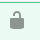
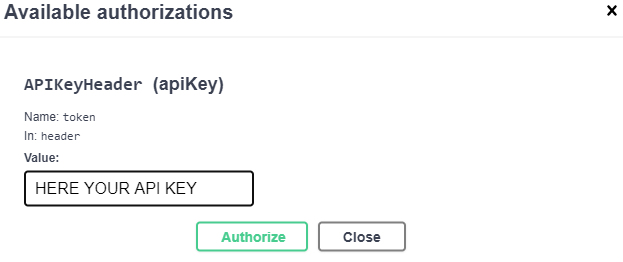

<div>
    <a href="https://github.com/sponsors/enriquecatala"></a>
    <a href="https://enriquecatala.com"></a>
    <a href="https://www.linkedin.com/in/enriquecatala"></a>
    <a href="https://twitter.com/enriquecatala"></a>
    <a href="https://youtube.com/enriquecatala"></a>
</div>

<a href="https://mvp.microsoft.com/es-es/PublicProfile/5000312?fullName=Enrique%20Catala"></a>

- [{{ cookiecutter.project_slug }}](#-cookiecutterproject_slug-)
  - [Setup](#setup)
    - [Optional performance parameters](#optional-performance-parameters)
  - [Setup your model](#setup-your-model)
  - [Test your API](#test-your-api)

>Author: [Enrique Catalá](https://www.linkedin.com/in/enriquecatala)
# {{ cookiecutter.project_slug }}

This RestAPI app has been created using [FastAPI base template](https://github.com/enriquecatala/fastapi-ai-template). 

>Please consider ❤️ [Sponsoring this project](https://github.com/sponsors/enriquecatala)

This is the template I use to expose my own deep neural networks in production.

This project includes a template for expose an Artificial Inteligence model composed by your own keras model, through a FastAPI API Rest configuration **ready for production**.

The output is a container ready to **deploy in your kubernetes cluster**.

## Setup

1. In the docker-compose.yml, go and configure the API_KEY. <br>
   A sample API key can be generated using Python REPL:
```python
import uuid
print(str(uuid.uuid4()))
```

### Optional performance parameters

You can fine tune your webserver by configuring the [boot.sh](boot.sh)

## Setup your model

Go to the [services/models.py](app/services/models.py) and add your own code

## Test your API

1. Go to http://127.0.0.1:{{ cookiecutter.port }}/docs
2. Click on the "lock" icon 
   
   
3. Write your API key
   
   
   
4. Have fun!
